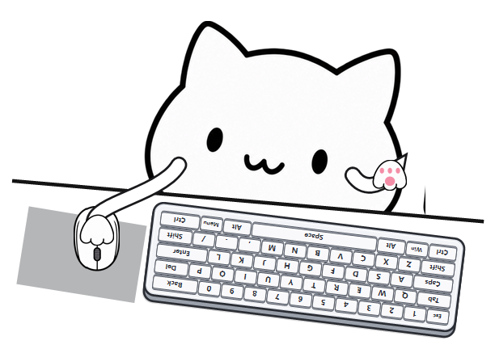

# BongoCat C++ · Keyboard & Mouse

Windows 10+ x64 桌面猫咪输入覆盖层。参考用户提供的《BongoCat-复刻大纲》，保留 C++17 / Win32 / GDI+，实现精简键盘、鼠标和多图层爪子动画。无第三方 GUI 框架，不联网、不记录输入内容。



[下载 Windows x64 v6 便携包](https://github.com/Irsatyn/Trial/raw/refs/heads/main/bongocat-cpp/releases/BongoCatDemo-Windows-v6.zip) · [下载源码包](https://github.com/Irsatyn/Trial/raw/refs/heads/main/bongocat-cpp/releases/BongoCatCpp-v6-source.zip) · [配置界面](docs/verification/v6/gui-preview.png)

## 运行与操作

解压完整 v6 便携包，双击 `BongoCatDemo.exe`，保留旁边的 `assets/cat-atlas-v3.png`。猫咪初次出现在主屏右下角。新版按用户参考图调整为猫咪探出斜桌面、鼠标在左、键盘在右。键盘整体朝向小猫，空格行靠近小猫，外框收紧留白，并增加薄底座、接触阴影、键帽侧边与高光，呈现轻微立体感；鼠标的按钮和滚轮也转向小猫，并同步旋转高亮；高亮和爪子落点使用同一坐标变换。

- 按住猫咪拖动：调整位置。
- 双击猫咪，或托盘菜单「图形化配置…」：打开配置面板。也可启动 `BongoCatDemo.exe --settings`。
- 面板可调整大小、不透明度、帧率、按键保持、鼠标平滑/移动幅度，以及跟随、置顶、穿透、暂停。调整即可预览，大小滑块在松手后应用，避免拖动时反复重建缓存。
- 「保存并关闭」持久化配置；「取消」或关闭面板恢复原设置及位置；「恢复默认」先预览默认值，保存后生效。支持 Tab 切换、方向键调节滑块、Enter 保存、Esc 取消。
- 右键猫咪或点击系统托盘：暂停、鼠标穿透、大小、恢复默认位置、重新加载设置、退出。
- 穿透开启后通过托盘恢复；托盘创建失败时自动禁止穿透，仍可右键猫咪退出。
- 托盘使用透明小猫脸图标，内含16–256px多个尺寸；图标嵌入EXE，配置窗口和EXE文件也使用同一图案，无需额外的图标文件。
- 窗口不抢焦点，正常输入继续交给当前软件。程序限制为单实例。

## 键盘和鼠标映射

这是精简 QWERTY 布局，展示字母 A–Z、数字 0–9、Esc、Tab、Caps、Backspace、Delete、Enter、左右 Shift/Ctrl/Alt、左 Win、Menu、空格、逗号、句号、斜杠。方向键已从图形和输入映射中移除；未展示的 F 区、数字小键盘和其他标点不会假映射到其他键。

键位按照 Windows 虚拟键码映射，与输入法或最终输入字符无关；例如中文输入法下物理 A 仍点亮 A。左右修饰键按扫描码与扩展标记区分。屏幕所画是简化布局，不宣称完整复刻特定型号键盘。

- 对应键帽变粉色；右侧键盘爪移至最新按下且仍可见的键，无按键时抬起露出粉色肉垫。
- 所有同时按下的键独立高亮；长按维持状态，松开恢复。自动重复不会让旧键抢走较新键的爪子。
- 快速轻触保留至少 50ms 的视觉反馈，避免一闪而过。
- 左侧爪子放在鼠标上，鼠标和手臂按整个虚拟桌面的光标位置平滑移动，移动范围可配置。
- 鼠标左/右/中键分别高亮按钮与滚轮；滚轮滚动时闪亮。

全局输入使用 `RegisterRawInputDevices + RIDEV_INPUTSINK`，不再使用低级键鼠钩子，不屏蔽其他软件的输入。没有捕获画面或读取其他程序内存。锁屏、安全桌面、远程会话和权限边界需在目标机器上实际验证。

## 设置

运行时在 EXE 旁生成 `settings.ini`，保存大小、坐标、显示与动画选项。配置面板关闭时，保存编辑后的 INI 约 1 秒内重新读取；也可使用托盘菜单重新加载。文件字段示例见 `settings.example.ini`。

```ini
[Window]
Width=612
Opacity=100
Topmost=1
ClickThrough=0
Paused=0

[Animation]
MaxFPS=60
MinPressMs=50
SmoothingMs=60
MouseRange=22
FollowMouse=1
```

`Width` 限制 384–1020 px，`Opacity` 30–100%，`MaxFPS` 30–120，`MinPressMs` 与 `SmoothingMs` 10–200，`MouseRange` 0–40 逻辑像素。位置 X/Y 可为负数，以适配主屏左边的显示器。保存位置时会检查最近显示器的工作区。

## CPU 与内存

- 启动时仅解码一张四图层 PNG。
- 静态猫咪、键盘和未按下的键帽只在启动/尺寸变化时绘制。
- 按下的键帽和字符也预先缓存，活动帧无需重复创建字体、栅格化键名。
- 持久 DIB、内存 DC、背景缓存、小尺寸鼠标与爪子缓存重复使用，逐帧不新建 GDI 位图。
- 无变化时取消帧等待，阻塞等待输入，仅保留 1Hz 的设置/异常松键检查。
- 配置面板使用原生控件，只在打开时分配字体和控件；关闭后释放。重复打开/关闭检查 GDI 对象没有增长。
- 动画期间以高精度一次性等待定时器调度；不调用 `timeBeginPeriod` 改变系统整体精度。不支持精确定时器的旧系统回退到普通窗口定时器。
- Raw Input 消息使用栈上固定缓冲；鼠标移动事件合并为画面更新，每次最多处理 64 条消息，避免高回报率鼠标饿死渲染。

实测结果见 `PERFORMANCE.md`。测试是在本机进行，实际键鼠设备、系统负载、尺寸与帧率会影响结果；活动基准使用内部模拟状态，不是 1000Hz 物理鼠标压力测试。未测量硬件输入到画面的端到端延迟，不能据此声称达到大纲里的 ≤16ms 指标。

## 构建

```powershell
powershell -ExecutionPolicy Bypass -File .\build.ps1
```

默认编译器 `C:\msys64\ucrt64\bin\g++.exe`，可用 `-Compiler` 指定其他 MinGW 路径。静态链接 GCC/C++ 运行库，只依赖 Windows 10+ 自带系统 DLL；便携包不需要安装 Qt/SFML。构建产物在 `dist`。

MSVC / CMake 配置已提供，但本次验证的是 MinGW 构建：

```powershell
cmake -S . -B build-msvc
cmake --build build-msvc --config Release
ctest --test-dir build-msvc -C Release --output-on-failure
```

## 验证模式

```powershell
Start-Process .\dist\BongoCatDemo.exe -ArgumentList '--self-test' -Wait
Start-Process .\dist\BongoCatDemo.exe -ArgumentList '--smoke-test' -Wait
Start-Process .\dist\BongoCatDemo.exe -ArgumentList '--idle-benchmark' -Wait
Start-Process .\dist\BongoCatDemo.exe -ArgumentList '--benchmark' -Wait
```

自检验证透明图集与实际渲染，输出 `preview.png`。冒烟检测注册真实 Raw Input，然后使用内部输入状态验证 A/J 和鼠标组合、大小、暂停和穿透，约 1.3 秒退出；它不向其他软件发送按键，也不能替代实体键鼠手测。两种基准各运行 10 秒，分别输出 `performance-idle.txt` 和 `performance-active.txt`，CPU 以单核满载为 100% 计算。

`tests/config_smoke.ps1` 会在独立的 `build/config-smoke` 目录验证尺寸范围、坐标/尺寸热重载、暂停保存和关闭；运行前请关闭普通 Demo 实例。该测试按高 DPI 真实像素读取窗口，不修改实际便携目录的设置。

`tests/gui_smoke.ps1` 在独立目录验证面板打开、预览不落盘、取消恢复尺寸与右下边缘位置、恢复默认、关闭取消、保存，以及反复打开的 GDI 稳定性。截图见 `dist/gui-preview.png`。

## 源码与素材

- `src/main.cpp`：窗口、Raw Input、帧调度、托盘、设置和性能检测。
- `src/input_state.h`：独立按下/松开、多键、最短保持与左右手选择。
- `src/key_layout.h`：可见键帽和虚拟键码的唯一映射表。
- `src/renderer.cpp`：图集边界识别、预渲染缓存、曲线手臂、动态合成。
- `src/settings_panel.cpp`：原生配置面板、DPI 布局、预览/保存/取消。
- `tests/input_test.cpp`：实际键位、组合键、长按、快速释放、重复和暂停测试。
- `assets/cat-atlas-v3.png`：参考上传图片由内置图像生成工具生成的透明图集。精确提示词在同目录 `.prompt.txt`；工具没有模型版本选择入口，因此不声明调用了指定的 Image 2 版本。键帽与字符由程序绘制。

原始三帧素材保留在源码 assets 中；当前程序使用新的独立图层，避免切换姿势时猫咪轮廓跳动。便携包只包含新版使用的图片。

## 文件目录

- `src/`、`tests/`：源码与验证脚本。
- `assets/`：当前图集、提示词及小猫ICO源素材；旧素材在 `assets/archive/`。
- `dist/`：当前可运行程序、必要素材、使用说明和配置。已有 `settings.ini` 保留。
- `releases/`：最新便携 ZIP；历史 v1–v5 在 `releases/archive/`。
- `docs/verification/v6/`：本次预览截图、GUI 截图和原始验证结果；重新运行测试会在 `dist/` 生成新结果。
- `tools/generate-tray-icon.ps1`：重建透明小猫图标（原生绘图，多尺寸ICO）。
- `build/`：可重新生成的编译缓存；旧测试副本和打包临时目录已清理。

## 与大纲的关系

本版完成常规键鼠覆盖层、多图层、程序化手臂、后台 Raw Input、原生配置 GUI、配置保存/重读、多屏位置检查和资源优化。四种 osu! 游戏模式、数位板、Live2D、SFML 迁移、三种 OBS 透明策略及自启动尚未实现。保留现有 `UpdateLayeredWindow` 真透明方案。用户原大纲未修改。

参考：[ayangweb/BongoCat](https://github.com/ayangweb/BongoCat)、[kuroni/bongocat-osu](https://github.com/kuroni/bongocat-osu)、[Microsoft Raw Input](https://learn.microsoft.com/en-us/windows/win32/inputdev/using-raw-input)。未复制原项目源码或模型。
